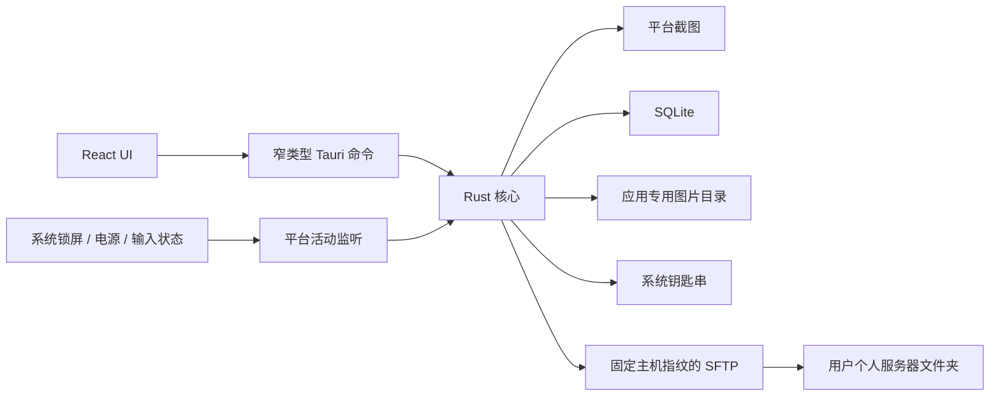

# 架构

Electronic Journey 在用户明确授权和主动运行时捕获桌面，在本机生成无损 WebP 原图和缩略图，并通过 SQLite 管理时间线。远程能力仅是用户确认后的个人 SFTP 文件夹上传；客户端不调用或感知任何 LLM、Hermes、提示词或模型。

## Rust 模块

- `capture/`：平台权限、截图适配和系统菜单栏/任务栏比较排除区域。
- `system_monitor/`：macOS 工作区/分布式通知与 CoreGraphics 空闲时间，以及 Windows 会话/电源窗口消息与 `GetLastInputInfo`。
- `capture_pipeline.rs`：完整像素与稳定内容去重、无损编码、原子写入、完整性回读和删除。
- `autostart.rs`：用户级开机自启动注册；macOS 写入 LaunchAgent，Windows 写入当前用户启动注册表项。
- `tray.rs`：从 Rust 运行摘要派生托盘状态、权限提示和操作可用性，并把操作路由回同一记录状态机。
- `timeline/`：SQLite 时间线和受控恢复扫描。
- `database/`：截图、远程配置和上传队列。
- `upload/`：输入验证、钥匙串、主机指纹、私钥认证和 SFTP 原子上传。
- `privacy/`：系统阻塞判定、macOS Bundle Identifier / Windows 路径哈希前台应用身份和本地排除规则匹配。
- `commands.rs`：面向前端的窄命令与用户可读错误。

## 记录状态与系统事件

`RuntimeState` 分开保存用户的记录意图和当前系统阻塞条件。用户开启记录不代表任何时刻都允许截图：锁屏、休眠或用户空闲会把有效状态切换为 `suspended` 并使当前调度代次失效。每个恢复事件只清除自己的条件；所有条件清除后才创建新的调度代次，并沿用首次截图的 10 秒延迟。用户在暂挂期间主动暂停或停止后不会自动恢复。

空闲时长由 Rust 每秒读取，阈值来自本地截图设置，0 表示关闭。平台监听无法安装或运行时读取失败会关闭记录意图、取消调度并进入可见错误状态，避免在隐私状态未知时继续采集。

托盘不维护第二份记录状态。菜单文字、工具提示和按钮可用性都由 `RuntimeState` 的精简摘要生成；菜单中的“今日截图”和“今日已上传”从 SQLite 动态读取，并在截图成功、上传成功或删除后刷新。主窗口命令、托盘操作、系统事件、权限刷新或截图失败改变状态后，会统一刷新托盘并向主 WebView 发送 `runtime-state-changed`。托盘缺少权限时只打开主窗口并说明后续操作，不直接调用平台授权请求。主窗口关闭事件被转换为隐藏，保持托盘入口可用；托盘退出操作才终止进程。

开机自启动是独立的操作系统用户级配置，不写入 SQLite。macOS 使用当前用户的 `~/Library/LaunchAgents/com.electronicjourney.app.plist`，Windows 使用 `HKCU\Software\Microsoft\Windows\CurrentVersion\Run`；启动参数使应用保持在托盘，不会自动改变记录状态。

## 上传数据流

1. 用户在时间线中勾选图片，UI 显示数量和总大小并要求确认。
2. Rust 用 UUID 创建唯一活动的 SQLite 上传批次，命令立即把批次 ID 和初始状态返回给 UI。
3. 独立 Rust 异步任务从受控目录重新读取原图，核对长度、SHA-256 和 WebP。
4. SSH 验证固定的 SHA-256 主机指纹并用私钥认证。
5. SFTP 写随机 `.part`，等待写入确认、关闭句柄并核对长度。
6. 临时文件原子改名，最终长度再次核对。
7. SQLite 持续写入逐项结果，UI 定时读取；页面切换只停止轮询，不终止上传。

应用重启不会自动重放网络上传。远端文件夹之后由什么程序读取，位于客户端架构边界之外。

## 本地组织与应用排除

收藏保存在 `captures.favorite`；标签使用 `tags` 与 `capture_tags` 多对多关系。它们只参与本地时间线展示和筛选，不进入图片文件或 SFTP 命名。

隐私规则由系统原生文件选择器添加。macOS 只从所选 `.app` 的 Info.plist 提取 Bundle Identifier，Windows 只保存所选 `.exe` 规范化路径的小写 SHA-256，不把完整路径返回前端。启用规则时，截图循环在平台捕获前后分别读取前台应用稳定身份。命中规则时不持久化；捕获后检查命中或身份无法确认时先清零 RGBA 再跳过本周期。当前不枚举窗口矩形，也不执行像素遮挡。
