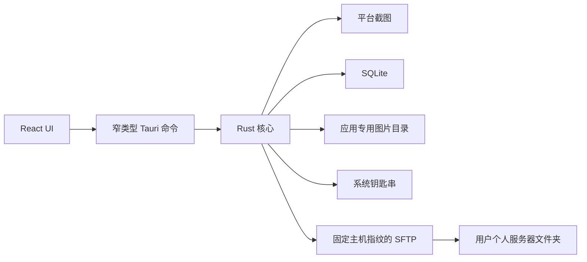

# 架构

Electronic Journey 在用户明确授权和主动运行时捕获桌面，在本机生成无损 WebP 原图和缩略图，并通过 SQLite 管理时间线。远程能力仅是用户确认后的个人 SFTP 文件夹上传；客户端不调用或感知任何 LLM、Hermes、提示词或模型。

## Rust 模块

- `capture/`：平台权限与截图适配。
- `capture_pipeline.rs`：无损编码、原子写入、完整性回读和删除。
- `timeline/`：SQLite 时间线和受控恢复扫描。
- `database/`：截图、远程配置和上传队列。
- `upload/`：输入验证、钥匙串、主机指纹、私钥认证和 SFTP 原子上传。
- `commands.rs`：面向前端的窄命令与用户可读错误。

## 上传数据流

1. 用户在时间线中勾选图片，UI 显示数量和总大小并要求确认。
2. Rust 用 UUID 创建唯一活动的 SQLite 上传批次，命令立即把批次 ID 和初始状态返回给 UI。
3. 独立 Rust 异步任务从受控目录重新读取原图，核对长度、SHA-256 和 WebP。
4. SSH 验证固定的 SHA-256 主机指纹并用私钥认证。
5. SFTP 写随机 `.part`，等待写入确认、关闭句柄并核对长度。
6. 临时文件原子改名，最终长度再次核对。
7. SQLite 持续写入逐项结果，UI 定时读取；页面切换只停止轮询，不终止上传。

应用重启不会自动重放网络上传。远端文件夹之后由什么程序读取，位于客户端架构边界之外。
