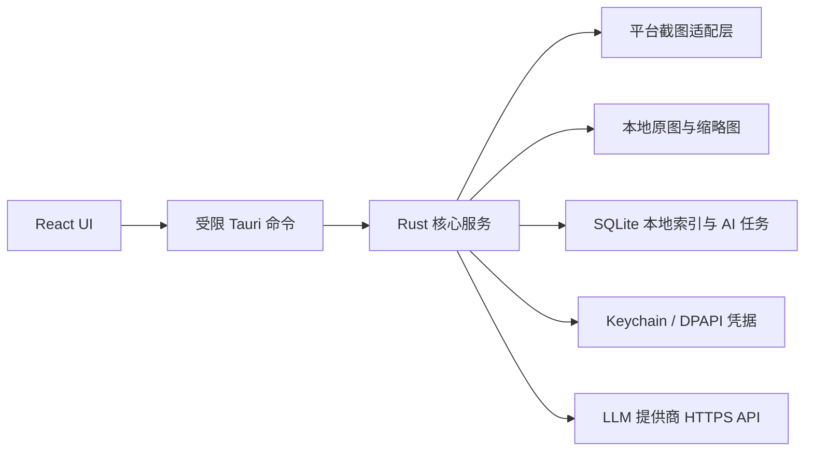

# 架构说明

## 系统边界

Electronic Journey 负责在用户明确授权且应用处于可见运行状态时，捕获用户选择的显示器，在本机生成原图和缩略图，并管理本地时间线。后续 AI 分析由用户选择图片并确认后，从 Rust 客户端直接调用其配置的 LLM 提供商。

系统不负责：

- 隐蔽监控、键盘记录、剪贴板记录、浏览器历史或麦克风采集。
- 自建图片上传、对象存储、云端时间线或多设备同步。
- 自建服务端代理或中转图片至 LLM 提供商。
- 未经用户确认自动分析新截图。
- 绕过 macOS 或 Windows 的系统权限和安全提示。
- 实时屏幕直播和远程控制。

## 组件

### React 表现层

`src/` 只负责设置、状态、时间线、图片选择和用户确认。普通浏览器开发模式使用本地演示状态，不触发截图、文件或网络能力。

### Tauri 命令层

`src-tauri/src/commands.rs` 是前端进入 Rust 的唯一入口。输入必须反序列化为明确类型并在 Rust 端再次校验。前端读取截图时只提交 UUID，不提交路径；平台能力文件只授予主窗口必要命令。

### Rust 核心服务层

- `capture/`：统一 `ScreenCapture` trait；macOS 和 Windows 适配器隔离。
- `capture_pipeline.rs`：原始分辨率无损 WebP、1440 像素缩略图、原子写入和回读验证。
- 时间线原图读取从 SQLite 解析 UUID 对应记录，在阻塞线程中执行受控路径检查、文件大小和 SHA-256 校验，再通过窄 IPC 返回；打开预览时不重复完整解码图片。
- `privacy/`：锁屏、休眠、空闲和排除应用的截图决策。
- `scheduler/`：截图计划和唤醒后跳过补拍语义。
- `database/`：SQLite 连接和迁移。
- `timeline/`：本地时间线数据模型。
- `credentials/`：后续通过 Keychain 或 DPAPI 保存用户 LLM 凭据。
- `llm/`：后续实现审核过的提供商适配器。
- `vault/`：当前保留原子文件写入工具；名称将在后续重构为 `storage/`。

## 一次截图的数据流

1. 调度器产生到期事件。
2. `PrivacyService` 检查状态、锁屏、休眠、空闲和排除规则。
3. 平台适配器捕获所选显示器。
4. 图片服务在内存中生成保留捕获像素尺寸的无损 WebP 原图和 1440 像素缩略图。
5. 存储服务分别使用临时文件、刷新和原子重命名写入原图与缩略图。
6. 重新读取并解码原图，通过验证后才报告本地保存成功。
7. SQLite 事务写入捕获 UTC 时间、IANA 时区、相对路径、摘要和缩略图状态。
8. 原始像素和编码缓冲区尽快释放。

## 一次 LLM 请求的数据流

1. 用户在时间线中选择一张或多张图片并输入问题。
2. 客户端显示图片、提供商、模型和目标域名。
3. 用户确认后创建本地 AI 任务。
4. Rust 根据截图 UUID 从受控目录读取并验证图片。
5. Rust 从 Keychain 或 DPAPI 读取该用户的提供商凭据。
6. Rust 通过 HTTPS 调用内置并审核过的提供商 endpoint。
7. 完整响应解析成功后，将回答和任务状态写入本地 SQLite。

当前版本尚未实现第 3 至 7 步，不会向任何 LLM 提供商发送截图。

## 当前实现状态

当前 macOS 原型已接通用户主动开始后的调度执行器、系统截图权限、主显示器单帧捕获、WebP 原图和缩略图、本地原子写入、回读验证、SQLite 时间线、后台启动索引恢复和缩略图懒加载。启动时先完成 SQLite 连接与迁移，再以缓存状态立即渲染首屏并异步刷新系统权限；受控图片目录的恢复扫描和容量统计在 WebView 加载完成后开始，且只对尚未进入索引的 WebP 执行解码与摘要校验。Windows.Graphics.Capture、锁屏/休眠监听、托盘、凭据管理和 LLM 适配器仍为待办。

## 架构约束

- 前端不得获得任意文件系统、shell、截图或网络权限。
- 图片读取接口只接受 UUID，并拒绝软链接、非普通文件、超大文件和未知格式。
- LLM API Key 或令牌只使用 Keychain 或当前用户作用域 DPAPI。
- 数据库存 UTC，并同时保存截图发生时的 IANA 时区。
- 本地保存与 AI 分析是两个独立状态；AI 失败不得影响截图。
- 图片、Authorization header、API Key、问题全文和完整回答不得进入日志。
- 产品方共享的 LLM API Key 不得内置在客户端。
