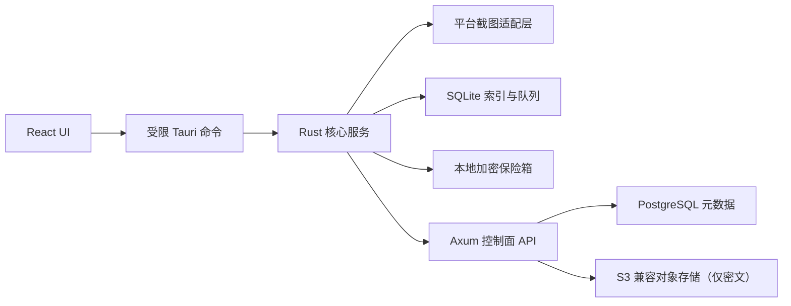

# 架构说明

## 系统边界

Electronic Journey 负责在用户明确授权且应用处于可见运行状态时，捕获用户选择的显示器，将画面在本机处理和认证加密，并管理本地时间线及可选的密文云同步。

系统不负责：

- 隐蔽监控、键盘记录、剪贴板记录、浏览器历史或麦克风采集。
- 服务端图片识别、明文缩略图、内容摘要或跨用户内容去重。
- 绕过 macOS 或 Windows 的系统权限和安全提示。
- 实时屏幕直播和远程控制。

## 组件

### React 表现层

`src/` 只负责设置、状态、时间线和用户操作。普通浏览器开发模式使用本地演示状态，不触发截图、文件或网络能力。

### Tauri 命令层

`src-tauri/src/commands.rs` 是前端进入 Rust 的唯一入口。输入必须反序列化为明确类型并在 Rust 端再次校验。平台能力文件只授予主窗口必要的核心窗口、应用和事件权限。

### Rust 核心服务层

- `capture/`：统一 `ScreenCapture` trait；macOS 和 Windows 适配器隔离。
- `privacy/`：锁屏、休眠、空闲和排除应用的截图决策。
- `scheduler/`：截图计划和唤醒后跳过补拍语义。
- `image/`：WebP 质量、最大宽度和本地重复检测策略。
- `crypto/`：XChaCha20-Poly1305 认证加密原语。
- `vault/`：同目录临时文件、刷新和原子重命名。
- `database/`：SQLite 连接和迁移。
- `upload/`：上传任务状态和并发策略。
- `timeline/`：本地时间线数据模型。

### 服务端

`server/` 是控制面 API。它负责身份、设备、预签名上传编排、对象回查、密文时间线元数据和删除状态，不持有任何明文主密钥。

## 一次截图的数据流

1. 调度器产生到期事件。
2. `PrivacyService` 检查状态、锁屏、休眠、空闲和排除规则。
3. 平台适配器捕获所选显示器。
4. 图片服务在内存中缩放、编码并可选执行重复检测。
5. 加密服务生成每文件数据密钥并认证加密图片和敏感元数据。
6. 保险箱服务写临时文件、刷新并原子重命名。
7. SQLite 事务写入截图索引和可选上传任务。
8. 上传服务异步上传密文，服务端回查对象后确认完成。
9. 明文像素和临时密钥尽快清零或释放。

## 当前实现状态

当前 macOS 原型已接通用户主动开始后的调度执行器、系统截图权限、主显示器单帧捕获、WebP 编码、Keychain 主密钥与本地原子加密写入。Windows.Graphics.Capture、完整文件容器回读、SQLite 时间线索引、锁屏/休眠监听、托盘、上传与删除工作流仍为待办；在这些恢复与隐私规则完成前不视为完整可信 MVP。

## 架构约束

- 前端不得获得任意文件系统、shell、截图或网络权限。
- 所有密钥和令牌使用 Keychain 或当前用户作用域 DPAPI。
- 数据库存 UTC，并同时保存截图发生时的 IANA 时区。
- 本地保存成功和云端上传成功是两个独立状态。
- 预签名 URL、Authorization header、恢复密钥和图片内容不得进入日志。
- 任何 AEAD 验证失败都不得返回部分明文。
