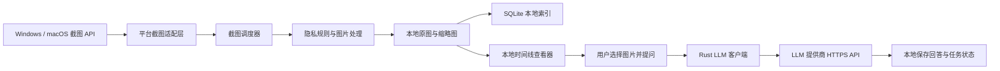
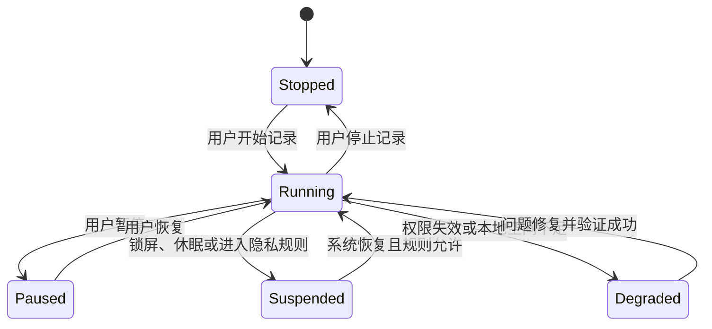

# Electronic Journey 跨平台桌面应用设计说明书

> 文档版本：0.2.0
> 文档状态：方案调整
> 更新日期：2026-07-29
> 目标平台：Windows、macOS

## 1. 文档概述

### 1.1 项目背景

Electronic Journey 是一款面向个人用户的数字旅程记录工具。应用在用户明确授权并处于运行状态时，按照设定的时间间隔截取桌面画面，将截图保存在本地，并允许用户选择本地截图直接向其配置的 LLM 提供商发起分析请求。

产品的目标不是监控用户或其他人员，而是帮助用户留存自己的数字生活轨迹，例如工作过程、学习记录、创作过程和阶段性回顾。

MVP 不建设图片云端同步或中转服务。图片默认只保存在用户设备上；只有在用户明确触发 AI 分析时，选中的图片和问题才从桌面客户端通过 HTTPS 直接发送给 LLM 提供商。

### 1.2 设计目标

- 同一套产品支持 Windows 和 macOS。
- 应用可以长期低资源占用地驻留在系统托盘或菜单栏。
- 网络中断、系统休眠或应用崩溃后能够安全恢复，不丢失已完成的截图。
- 用户可以随时暂停、查看、导出和删除自己的记录。
- 所有敏感能力保持可见、可控、可撤销。
- 时间线直接显示本地缩略图，并能快速打开原图。
- 用户可以明确选择图片和问题，由本地客户端直连 LLM 提供商。
- 架构能够支持后续加入本地 OCR 和时间线搜索。

### 1.3 非目标

第一阶段不包含以下能力：

- 隐蔽运行、隐藏托盘图标或绕过系统截图授权。
- 键盘记录、剪贴板记录、浏览器历史收集或麦克风录音。
- 企业员工监控、远程监控或管理员强制截图。
- 自建图片上传、对象存储、云端时间线和多设备同步。
- 自建服务端代理或中转图片至 LLM 提供商。
- 在没有用户操作的情况下自动把截图发送给 LLM。
- 将产品方共享的 LLM API Key 内置在桌面安装包中。
- 实时屏幕直播或远程控制。
- 手机端截图。

## 2. 技术选型

### 2.1 推荐技术栈

| 模块 | 技术选型 | 用途 |
|---|---|---|
| 桌面应用框架 | Tauri 2 | 窗口、托盘、应用生命周期、安装包和升级 |
| 前端界面 | React + TypeScript + Vite | 设置、时间线、状态展示和用户交互 |
| 核心逻辑 | Rust | 调度、截图适配、图片处理、本地存储和 LLM 请求 |
| Windows 截图 | Windows.Graphics.Capture | 获取显示器画面 |
| macOS 截图 | ScreenCaptureKit | 获取显示器画面并遵循系统权限机制 |
| 本地数据库 | SQLite + `sqlx` | 截图索引、AI 任务和非敏感配置 |
| HTTP 客户端 | `reqwest` | 从 Rust 客户端调用 LLM 提供商 API |
| 图片编码 | Rust `image` 及 WebP 编码库 | 原图、缩略图、缩放和格式转换 |
| 凭据存储 | macOS Keychain / Windows DPAPI | 保护用户提供的 LLM API Key 或令牌 |
| 自动升级 | Tauri Updater | 验证签名后安装更新 |

### 2.2 选择 Tauri 2 的原因

- 后台常驻资源占用相对较低。
- Rust 适合处理文件、并发、图片和密码学逻辑。
- 敏感能力可以保留在 Rust 端，前端只能调用经过授权的有限命令。
- 可以通过平台适配层分别接入 Windows 和 macOS 原生截图 API。
- 支持 Windows 和 macOS 安装包、代码签名及签名升级。
- React 前端便于快速实现设置页和时间线等产品界面。

### 2.3 备选方案

| 方案 | 适用场景 | 主要取舍 |
|---|---|---|
| Electron | 团队只熟悉 JavaScript，需要快速验证 | 开发快，但长期驻留的内存和安装包通常更大 |
| Avalonia | 团队主要使用 C#/.NET | UI 跨平台能力较好，仍需平台截图适配 |
| Flutter Desktop | 需要高度自定义的统一界面 | 桌面后台、托盘和截图能力需要较多原生插件 |
| 双原生客户端 | 对平台体验和系统集成要求最高 | 需要维护两套客户端，成本最高 |

## 3. 总体架构



### 3.1 客户端分层

#### 表现层

负责设置页、时间线、状态展示和用户操作，不直接访问任意文件、网络或操作系统截图接口。

#### Tauri 命令层

向前端暴露经过限制的命令，例如：

- 查询当前记录状态。
- 开始或暂停记录。
- 更新截图周期。
- 选择本地保存目录。
- 获取时间线分页数据。
- 读取指定截图或缩略图。
- 导出或删除指定截图。
- 创建、取消和查询指定截图的 AI 分析任务。

Tauri capability 应遵循最小权限原则，只为指定窗口启用必要命令。React 表现层不得获得任意文件系统或任意网络访问能力。

#### 核心服务层

由 Rust 实现以下服务：

- `CaptureService`：调用平台截图适配器。
- `SchedulerService`：管理时间计划、休眠恢复和跳过策略。
- `PrivacyService`：判断是否处于允许截图的状态。
- `ImageService`：生成原图、缩略图、压缩和重复画面检测。
- `StorageService`：原子写入、读取和删除本地文件。
- `CredentialService`：通过 Keychain 或 DPAPI 管理 LLM 凭据。
- `LlmService`：校验请求、读取选定图片并调用已配置的提供商。
- `AiJobService`：管理分析任务、取消、重试和结果落库。
- `TimelineService`：提供本地时间线索引。

#### 平台适配层

统一定义截图接口，由 Windows 和 macOS 分别实现：

```rust
pub trait ScreenCapture {
    async fn permission_state(&self) -> Result<PermissionState>;
    async fn request_permission(&self) -> Result<PermissionState>;
    async fn list_displays(&self) -> Result<Vec<DisplayInfo>>;
    async fn capture(&self, display_id: &DisplayId) -> Result<CapturedImage>;
}
```

macOS 使用 ScreenCaptureKit；Windows 使用 Windows.Graphics.Capture。上层不依赖具体平台类型。

### 3.2 外部 LLM 提供商边界

MVP 不包含自建图片服务器。LLM 提供商是唯一会在用户主动分析时接收图片内容的外部数据处理方。

- 客户端只允许连接用户明确配置并由应用支持的 HTTPS API endpoint。
- 用户使用自己的 API Key，或使用提供商为该用户签发的 OAuth/短期令牌。
- 产品方共享密钥不得写入代码、安装包、前端资源或普通配置文件。
- API Key 和刷新令牌必须保存在 Keychain 或当前用户作用域的 DPAPI 中。
- 图片请求由 Rust 发出，不向 React 暴露凭据、Authorization header 或任意网络能力。
- 不接受图片内容、配置文件或模型回答返回的任意 endpoint，防止请求目标注入和凭据外泄。
- 提供商的数据保留、训练使用、地区和删除能力必须在启用前向用户说明。

## 4. 功能设计

### 4.1 首次启动

首次启动引导包含：

1. 阅读隐私说明并主动开启记录功能。
2. 选择截图间隔和工作时间。
3. 选择要记录的显示器。
4. 请求系统屏幕录制权限。
5. 选择本地保存文件夹或使用默认目录。
6. 执行测试截图、缩略图生成、原子写入和回读验证。
7. 可选：选择支持的 LLM 提供商并配置用户自己的凭据。
8. 可选：阅读第三方数据处理说明，并发送一张明确选择的测试图片验证连接。

任何一个必要步骤失败时，都应明确显示失败原因，不应把“已请求权限”或“请求已发出”视为成功。

### 4.2 定时截图

用户可以配置：

- 截图间隔，建议允许 1、2、5、10、15、30 和 60 分钟。
- 生效的星期。
- 每日生效时间段。
- 要记录的显示器。
- 是否在用户空闲时继续截图。
- 是否跳过重复画面。
- 图片质量和最大分辨率。

默认配置：

- 每 5 分钟截图一次。
- 用户连续空闲 10 分钟后暂停。
- 锁屏、休眠和登录界面不截图。
- 唤醒后恢复正常计划，不补拍休眠期间的任务。
- 原图使用无损 WebP 并保留平台截图返回的像素尺寸，不对本地原图设置最大宽度。
- 时间线缩略图最大宽度为 1440 像素；今日页只读取最新一张原图，以兼顾 Retina / 高 DPI 清晰度和整体本地占用。
- 只记录用户首次选择的显示器。

### 4.3 运行状态

状态机定义如下：



托盘或菜单栏必须持续显示当前状态：

- 绿色：正在记录。
- 黄色：临时暂停或等待权限。
- 红色：本地保存失败或其他需要处理的问题。
- 灰色：记录功能已停止。

LLM 请求失败不应阻止本地截图，也不得改变本地截图的保存状态。

### 4.4 暂停与隐私规则

支持以下控制：

- 暂停 15 分钟。
- 暂停 1 小时。
- 暂停到第二天。
- 无限期暂停。
- 跳过用户配置的应用。
- 可选的截图前通知。
- 删除最近一张截图。

默认不收集窗口标题、应用内文本、键盘输入、剪贴板或浏览历史。

第一阶段的 Windows 应用排除策略可以采用“检测前台应用并跳过本次截图”。macOS 可在平台能力允许时使用 ScreenCaptureKit 内容过滤。后续如加入 OCR 脱敏，必须在本地、发送给 LLM 前执行。

### 4.5 时间线

时间线提供：

- 按日期分组浏览。
- 按显示器筛选。
- 直接显示本地缩略图。
- 放大查看原图。
- 右键图片可查看原图或发起单张删除。
- 导出单张或日期范围。
- 删除单张或日期范围。
- 标记收藏。
- 查看每张图片的 AI 分析状态和历史回答。

截图保存时同步生成最大宽度 1440 像素的 WebP 缩略图。时间线只加载当前视口及邻近区域的缩略图；今日页从 SQLite 查询最新一条记录并读取单张原图，以保证大卡片的高 DPI 清晰度。点击时间线卡片后立即打开预览容器并按需加载原图；成功打开后可在受限内存缓存中预取前后相邻原图。缩略图只保存在本机，不发送给 LLM，除非它就是用户明确选择的请求图片。

单张删除是不可撤销的显式操作。React 只提交截图 UUID；Rust 从 SQLite
解析并验证原图与缩略图均位于受控目录，然后把文件原子重命名到同目录的隔离名称。
确认截图未被 AI 任务引用后，在 SQLite 事务中删除索引，再移除隔离文件。数据库
删除失败时恢复原文件名；只有数据库记录、原路径和隔离路径均确认不存在后，界面
才显示删除完成。已被 AI 任务引用的截图在定义关联数据的级联语义前禁止删除。

### 4.6 本地存储与 AI 分析模式

截图始终使用本地模式：

- 原图和缩略图只写入本地目录。
- 不自动上传、同步或备份图片。
- 不建设自有图片对象存储。
- 是否启用 LLM 分析不影响截图、预览、导出和删除。

AI 分析是独立且由用户触发的动作：

- 用户明确选择一张或多张图片。
- 用户输入问题并确认目标提供商和模型。
- 客户端显示即将发送的图片数量和目标域名。
- 用户确认后，Rust 客户端读取图片并直接调用提供商 API。
- 回答和最小必要的任务元数据保存在本地。
- 关闭 AI 功能或删除凭据后，后台不得继续发送新请求。

MVP 使用普通 WebP 文件，不提供应用层静态加密。产品必须明确提示本地文件会受到操作系统账户权限、FileVault 或 BitLocker 等系统能力保护，但具有本机文件访问权限的其他程序可能读取图片。

## 5. 截图处理流程

一次截图任务的执行顺序：

1. 调度器产生到期事件。
2. 检查记录状态、系统锁定状态、空闲状态和隐私排除规则。
3. 为本次任务生成唯一 `capture_id`。
4. 调用平台适配层获取目标显示器画面。
5. 在内存中完成原始像素尺寸的无损 WebP 编码和可选的重复检测。
6. 从原图生成宽度受限的 WebP 缩略图。
7. 将原图写入同目录临时文件，刷新并原子重命名。
8. 将缩略图写入同目录临时文件，刷新并原子重命名。
9. 在 SQLite 事务中创建截图记录。
10. 清理内存中的原始像素和编码缓冲区。

如果原图写入或回读验证失败，不得将任务标记为成功。缩略图失败可以标记为待重建，但不得伪装为已生成。启动恢复时应检查并清理超时临时文件。

## 6. 本地数据与 LLM 凭据设计

### 6.1 威胁模型

需要防护：

- 网络传输被窃听或篡改。
- LLM 凭据从前端、日志或普通配置文件泄露。
- 图片在未获用户同意时被自动或错误发送。
- 图片被发送给未配置或被注入的网络 endpoint。
- LLM 请求、错误报告和调试日志意外记录图片内容。
- 本地文件路径遍历、软链接或任意文件读取。
- 本地图片和 SQLite 索引因部分写入或崩溃而不一致。

不能完全防护：

- 用户已解锁且本机已被恶意软件完全控制。
- 攻击者能够读取应用进程内存。
- 具有本机文件读取权限的其他程序读取普通 WebP。
- LLM 提供商按照其条款保留或处理已经发送的数据。
- 用户主动发送的截图本身包含密码、私钥或其他高度敏感信息。

### 6.2 本地图片保护

- 图片写入应用专用目录，使用不可预测的 UUID 文件名。
- 文件和目录权限限制为当前系统用户可访问。
- 推荐用户开启 FileVault 或 BitLocker。
- 前端只按截图 UUID 请求图片，不得传入任意绝对路径。
- Rust 端拒绝路径分隔符、软链接、非普通文件、超大文件和未知图片格式。
- 原图和缩略图均使用临时文件、刷新和原子重命名。
- 数据库只保存相对路径；解析后的路径必须验证仍位于应用管理目录内。

### 6.3 LLM 凭据存储

- macOS：API Key、OAuth access token 和 refresh token 保存到 Keychain。
- Windows：使用当前用户作用域的 DPAPI 保护凭据。
- SQLite、日志、普通配置文件和前端状态不得保存明文凭据。
- React 不得读取完整凭据；只显示提供商、凭据是否存在和末尾少量掩码字符。
- 用户删除凭据后必须验证安全存储中的对应条目已删除，并取消尚未开始的任务。

### 6.4 直连 LLM 请求

- 仅支持应用内置并审核过的提供商适配器和 HTTPS 域名。
- 请求由 Rust `reqwest` 客户端发送，并启用正常证书验证。
- 每次请求必须绑定明确的本地 `capture_id` 列表、问题、提供商和模型。
- 发送前显示图片数量、目标提供商和可能的数据保留提示。
- 请求体、图片字节、Authorization header 和完整回答不得进入网络调试日志。
- 设置连接、读取和总请求超时；支持用户取消。
- 响应大小必须设置上限；解析失败不得覆盖已有回答。
- 模型返回的 URL、路径、工具调用或指令不自动执行。
- 提供商支持时，默认选择不用于训练或最短数据保留设置。

### 6.5 单一图片格式

MVP 只支持普通 WebP 原图和 WebP 缩略图：

- 时间线、启动索引和读取命令只识别受控 `captures/` 与 `thumbnails/` 目录中的 WebP。
- SQLite 不保存图片格式分支字段；原图 MIME 类型固定为 `image/webp`。
- 原型阶段的加密容器、上传队列和对应密钥已经清理，不再提供迁移或兼容读取入口。

## 7. 本地存储设计

### 7.1 默认目录

默认使用应用本地数据目录，并允许用户选择其他受控目录：

```text
ElectronicJourney/
├── captures/
│   └── <year>/<month>/<day>/<capture-id>.webp
├── thumbnails/
│   └── <year>/<month>/<day>/<capture-id>.webp
├── exports/
└── electronic-journey.sqlite3
```

用户可以选择其他目录。应用不能假定用户目录路径，也不能依赖指向项目外部的软链接。

### 7.2 SQLite 数据表

#### `captures`

| 字段 | 类型 | 说明 |
|---|---|---|
| `id` | TEXT PK | 截图 UUID |
| `device_id` | TEXT | 来源设备 |
| `display_id` | TEXT | 来源显示器的本地标识 |
| `captured_at_utc` | TEXT | UTC 时间 |
| `timezone` | TEXT | 截图时的 IANA 时区 |
| `local_path` | TEXT | 本地原图相对路径 |
| `thumbnail_path` | TEXT NULL | 本地缩略图相对路径 |
| `file_size` | INTEGER | 原图大小 |
| `content_sha256` | TEXT | 原图内容摘要，用于损坏检测 |
| `thumbnail_state` | TEXT | `ready/pending/failed` |
| `created_at_utc` | TEXT | 记录创建时间 |

#### `ai_jobs`

| 字段 | 类型 | 说明 |
|---|---|---|
| `id` | TEXT PK | AI 任务 UUID |
| `provider` | TEXT | 已支持的提供商标识 |
| `model` | TEXT | 用户选择的模型标识 |
| `question` | TEXT | 用户提交的问题 |
| `state` | TEXT | `pending/running/completed/failed/cancelled` |
| `attempt_count` | INTEGER | 尝试次数 |
| `last_error_code` | TEXT | 脱敏错误码 |
| `response_text` | TEXT NULL | 成功后的回答 |
| `created_at_utc` | TEXT | 创建时间 |
| `updated_at_utc` | TEXT | 更新时间 |

图片与任务使用 `ai_job_captures(job_id, capture_id, ordinal)` 关联。删除截图前必须提示相关回答的处理方式，且运行中的任务不得继续读取已删除图片。

#### `settings`

只保存非敏感设置，例如间隔、时间段、显示器选择、图片质量、提供商标识和模型标识。API Key 和令牌不得保存在该表。

### 7.3 时间语义

- 数据库存储 UTC。
- 同时保存截图发生时的 IANA 时区。
- 界面默认按当前系统时区显示。
- 日期分组应基于用户选择的展示时区。

## 8. LLM 提供商接口设计

### 8.1 提供商适配器

不同提供商由 Rust trait 隔离，业务层不依赖特定请求格式：

```rust
pub trait LlmProvider {
    async fn validate_credential(&self) -> Result<CredentialStatus>;
    async fn analyze_images(
        &self,
        request: AnalyzeImagesRequest,
        cancellation: CancellationToken,
    ) -> Result<AnalyzeImagesResponse>;
}
```

`AnalyzeImagesRequest` 只接受已从本地数据库解析出的截图 UUID，不接受任意路径或 URL。适配器负责 MIME 类型、图片编码、请求大小限制和提供商错误的脱敏映射。

### 8.2 用户确认

创建请求前必须展示：

- 选中的图片预览和数量。
- 用户问题。
- 提供商和模型。
- 实际请求目标域名。
- 图片将离开本机并受第三方条款约束的提示。

只有用户点击确认后才能创建 `ai_jobs` 记录并读取图片。MVP 不提供自动分析全部新截图的开关。

### 8.3 请求与结果

- 原图默认按提供商限制缩放或重新编码；界面应说明是否发送原始分辨率。
- 多图请求在发送前检查图片数、单图大小、总大小和模型能力。
- 任务状态只在收到并成功解析完整响应后改为 `completed`。
- 取消或超时后停止继续读取响应；如果提供商已经接收请求，界面不得声称第三方已删除数据。
- 回答保存在 SQLite；如需保存结构化结果，必须进行版本化并保留原始文本。

### 8.4 凭据验证

凭据验证只发送提供商所需的最小请求，不包含用户截图。验证成功仅表示当时的凭据可用，不表示后续图片请求一定成功。

## 9. AI 任务与重试

### 9.1 任务策略

- 本地截图保存与 AI 分析完全解耦。
- 同一任务只允许一个执行者进入 `running`。
- 默认最多并发一个包含图片的 LLM 请求。
- 用户可以取消等待中或运行中的任务。
- 默认不自动重试包含图片的请求，避免在响应丢失时重复计费或重复发送敏感图片。
- 用户手动重试时创建新的尝试记录，并明确提示可能重复计费。

### 9.2 错误分类

| 类型 | 示例 | 处理 |
|---|---|---|
| 可重试 | 断网、连接超时、提供商 5xx | 标记失败并允许用户手动重试 |
| 凭据问题 | 401、403、令牌失效 | 停止请求并提示重新配置凭据 |
| 限流或额度 | 429、余额不足 | 显示脱敏原因和提供商建议等待时间 |
| 请求不支持 | 图片过大、格式或模型不支持 | 保留本地图片，提示调整模型或图片 |
| 本地高风险 | 磁盘已满、图片丢失或无法解码 | 停止相关任务并进入可见错误状态 |

### 9.3 本地容量上限

默认本地图片上限为 10 GB。达到阈值时：

1. 停止创建新截图。
2. 保留既有文件，不自动删除任何记录。
3. 向用户显示释放空间、修改目录或调整保留策略的入口。

除非用户预先明确开启按规则清理，否则不应为了继续截图而自动删除记录。

## 10. 隐私与安全要求

### 10.1 用户知情

- 截图功能必须由用户主动开启。
- 托盘或菜单栏图标不能隐藏。
- 权限被撤销后必须停止截图。
- 开机启动必须由用户显式启用。
- 应用退出时明确说明是否同时停止后台服务。
- 不提供静默部署或绕过系统提示的功能。

### 10.2 日志规范

允许记录：

- 截图任务 ID。
- AI 任务 ID。
- 时间、耗时、图片数量和总字节数。
- 状态码和脱敏错误码。
- 队列长度。

禁止记录：

- 图片内容或缩略图。
- API Key、access token 和 refresh token。
- Authorization Header。
- Cookie。
- 用户问题和完整模型回答，除非用户明确导出诊断包并预览内容。
- 窗口标题和用户正在编辑的文字。
- 用户选择目录中的其他文件名。

### 10.3 网络要求

- LLM 提供商 API 只允许 HTTPS。
- 客户端验证提供商证书，不提供关闭证书验证的生产配置。
- 只允许连接内置适配器声明的域名和端口，不允许图片、提示词或模型回答覆盖 endpoint。
- 禁止 HTTP 重定向将 Authorization header 带到不同源。
- 代理配置遵循操作系统设置时，界面应提示企业代理可能接触传输元数据。
- 网络请求必须设置大小、连接、读取和总时长限制。

### 10.4 软件供应链

- macOS 应用进行 Developer ID 签名和公证。
- Windows 安装包进行 Authenticode 签名。
- 自动更新包必须验证 Tauri 更新签名。
- 更新私钥与应用代码仓库分离保存。
- 依赖版本锁定，并定期执行漏洞扫描。

## 11. 性能与容量

### 11.1 资源目标

建议第一阶段目标：

- 无截图任务时 CPU 接近空闲。
- 常驻内存目标不超过 150 MB。
- 单次截图处理完成后立即释放原始像素缓冲区。
- 图片编码、文件读取、完整性校验、缩略图生成和 LLM 请求不阻塞 UI 线程。
- 预览读取使用数据库记录的文件大小和 SHA-256 校验完整性，不为每次打开重复执行完整图片解码；WebView 解码失败必须显示为预览失败。
- 默认最多同时处理一个截图任务，避免任务堆积。

### 11.2 容量估算

按照每天活跃 10 小时、每 5 分钟一张计算：

```text
120 张/天 × 400 KB ≈ 48 MB/天
48 MB × 30 天 ≈ 1.44 GB/月
1.44 GB × 12 月 ≈ 17.28 GB/年
```

双显示器会接近翻倍。实际大小取决于屏幕分辨率、变化程度和图片质量。

重复检测只在本地执行。发送给 LLM 前可以按模型限制生成一次性内存编码，不额外落盘长期副本。

## 12. 异常恢复

### 12.1 启动恢复

应用启动时执行：

1. 检查数据库迁移状态。
2. 扫描并清理超时临时文件。
3. 将上次异常退出遗留的 `running` AI 任务改为 `failed`，不得自动重发图片。
4. 校验数据库引用的本地原图和缩略图是否存在。
5. 将缺失缩略图标记为 `pending`，在空闲时重建。
6. 检查系统截图权限。
7. 恢复符合时间计划的记录状态。

### 12.2 休眠和唤醒

- 休眠前停止正在进行的平台截图会话。
- 唤醒后重新枚举显示器。
- 等待系统状态稳定后恢复调度。
- 不为休眠期间积压的时间点补拍截图。
- 外接显示器消失时暂停对应显示器，不自动改为其他屏幕。

### 12.3 文件损坏

- 使用内容 SHA-256 和图片解码验证检测本地文件损坏。
- 损坏原图不得发送给 LLM，也不得显示为成功预览。
- 缩略图损坏时从已验证的原图重建。
- 数据库与文件不一致时保留仍可验证的文件，并向用户提供重新索引或移除失效记录的选择。

## 13. 界面设计

### 13.1 今日

展示：

- 当前记录状态。
- 下次截图时间。
- 今日已记录数量。
- 本地占用。
- 待处理和失败的 AI 任务数量。
- 最近一张截图。
- 快速暂停按钮。

### 13.2 时间线

以日期为主轴直接展示本地缩略图，支持分页、视口懒加载和原图弹窗。原图弹窗立即展示加载状态，默认按“一个源像素对应一个屏幕物理像素”显示，并支持适应窗口、源图 100% 和缩放；预览使用有数量与字节上限的本地内存缓存。用户可以选择一张或多张图片向已配置的 LLM 提问。

### 13.3 隐私中心

包含：

- 生效时段。
- 显示器选择。
- 应用排除名单。
- 空闲暂停规则。
- 截图前通知。
- 发送图片给第三方 LLM 前的确认规则。
- LLM 提供商的数据处理说明。
- 权限状态及打开系统设置入口。

### 13.4 存储与 AI 设置

包含：

- 本地图片目录和容量。
- 保留策略。
- LLM 提供商、模型和凭据状态。
- 测试凭据、更新凭据和删除凭据。
- AI 请求历史、失败原因和取消入口。
- 导出、删除和重建缩略图。

## 14. 项目目录建议

```text
electronic-journey/
├── src/
│   ├── components/
│   ├── pages/
│   ├── stores/
│   ├── api/
│   └── types/
├── src-tauri/
│   ├── capabilities/
│   ├── migrations/
│   ├── src/
│   │   ├── capture/
│   │   │   ├── mod.rs
│   │   │   ├── windows.rs
│   │   │   └── macos.rs
│   │   ├── credentials/
│   │   ├── database/
│   │   ├── llm/
│   │   ├── privacy/
│   │   ├── scheduler/
│   │   ├── storage/
│   │   └── lib.rs
│   ├── Cargo.toml
│   └── tauri.conf.json
├── docs/
│   ├── threat-model.md
│   ├── local-storage.md
│   └── llm-providers.md
└── README.md
```

## 15. 开发阶段

### 15.1 阶段一：本地可信 MVP

- Tauri 项目骨架。
- Windows 和 macOS 截图权限及单次截图。
- 托盘状态与开始、暂停功能。
- 定时调度和休眠恢复。
- 原图和缩略图生成。
- 普通 WebP 原子写入和回读验证。
- SQLite 时间线和缩略图懒加载。
- 删除和导出。

### 15.2 阶段二：客户端直连 LLM

- 提供商适配器接口。
- BYOK 或提供商面向单个用户的 OAuth。
- Keychain 和 DPAPI 凭据存储。
- 单图、多图提问与本地回答历史。
- 请求确认、取消、超时和手动重试。
- 凭据、图片和请求日志泄露测试。

### 15.3 阶段三：旅程增强

- 本地 OCR。
- 本地全文搜索。
- 应用级隐私遮挡。
- 用户主动触发的每日摘要。
- 收藏和标签。
- 按日期导出个人旅程包。

## 16. 测试计划

### 16.1 功能测试

- 不同截图间隔能够正确生效。
- 多显示器选择和热插拔处理正确。
- 暂停、恢复和时间段规则正确。
- 缩略图直接展示、懒加载和原图预览正确。
- 用户确认后才能创建并发送 LLM 请求。
- 不同提供商的凭据验证、单图和多图请求正确。
- AI 任务取消、超时、失败和手动重试正确。
- 导出及删除行为符合预期。

### 16.2 平台测试

- macOS 首次授权、拒绝授权和撤销授权。
- Windows 捕获能力检测及显示器变化。
- 不同 DPI、缩放比例和分辨率。
- Intel 与 Apple Silicon macOS。
- Windows x64，必要时扩展到 ARM64。

### 16.3 可靠性测试

- 写文件中途强制结束进程。
- LLM 请求发送中途断网或取消。
- LLM 响应超时、截断或超过大小上限。
- 系统睡眠和唤醒。
- 本地磁盘已满。
- 数据库被锁定或迁移失败。
- 重复启动应用。
- 自动更新中断。

### 16.4 安全测试

- API Key 和令牌不出现在 SQLite、前端状态、日志、错误报告和诊断包中。
- 未经用户确认不能发送任何图片。
- endpoint 注入、跨域重定向和模型返回内容不能改变请求目标。
- UUID 参数不能读取任意路径、软链接或应用目录外文件。
- 删除凭据后新任务不能继续调用提供商。
- 日志中不存在图片、Authorization header、问题全文或完整回答。
- 前端不能调用未授权的 Tauri 命令。
- 自动更新不能安装无有效签名的包。

## 17. MVP 验收标准

第一版满足以下条件方可视为完成：

- 用户可以在 Windows 和 macOS 上完成截图授权。
- 用户可以开始、暂停和停止记录。
- 应用按设定间隔截图，锁屏和休眠期间不截图。
- 截图以普通 WebP 原图和缩略图原子写入指定或默认目录。
- 应用重启后可以读取并展示历史截图。
- 时间线卡片直接显示本地缩略图，点击后可以查看原图。
- 用户能够删除本地截图及其缩略图。
- 未配置 LLM 凭据时，截图、时间线和导出仍完整可用。
- 用户明确选择图片并确认后，客户端能够直接调用配置的 LLM 提供商。
- LLM 请求失败、取消或断网不影响本地截图。
- 用户可以删除 LLM 凭据和本地回答历史。
- 托盘始终能显示真实运行状态。
- 日志不包含截图内容、API Key、令牌、Authorization header、问题全文或完整回答。

## 18. 风险与待确认事项

| 风险或问题 | 影响 | 建议 |
|---|---|---|
| macOS 权限体验和系统版本差异 | 首次使用可能需要跳转系统设置或重启应用 | 首次引导中提供状态检测和明确说明 |
| Windows 捕获提示与后台体验 | 可能影响无干扰记录体验 | 优先遵循系统安全模型并进行原型验证 |
| 长期存储成本 | 多显示器和高分辨率会快速增长 | 提供质量、间隔和保留策略 |
| 本地普通 WebP 被其他程序读取 | 截图隐私泄露 | 限制目录权限，推荐 FileVault/BitLocker，并保留未来本地加密选项 |
| LLM 凭据被提取 | 产生费用或数据泄露 | Keychain/DPAPI、Rust 窄接口、日志扫描和可撤销凭据 |
| LLM 提供商保留图片 | 用户无法仅靠本地删除撤回第三方数据 | 发送前披露条款，优先短保留配置，不作无法验证的删除承诺 |
| 共享 API Key 被内置 | 密钥可被任何安装者提取和滥用 | MVP 只支持 BYOK 或提供商面向单用户的 OAuth/短期令牌 |
| 请求重复发送 | 重复计费和重复披露图片 | 默认不自动重试，手动重试前提示 |
| 本机被完全入侵 | 图片和运行中的凭据可能暴露 | 明确威胁边界，缩短敏感数据驻留时间 |

实施前还需要确认：

- MVP 是否必须支持多显示器同时截图。
- MVP 首个支持的 LLM 提供商和模型。
- 首版只支持 BYOK，还是同时支持提供商 OAuth。
- 默认发送原图还是经过尺寸与质量限制的副本。
- 是否允许多图请求，以及单次图片数和总字节上限。
- LLM 回答是否永久保存在本地，或提供自动清理周期。
- 首发最低系统版本。
- 产品是否需要上架 Mac App Store 和 Microsoft Store，还是先采用官网下载。

## 19. 参考资料

- [Tauri 2 Capabilities](https://v2.tauri.app/security/capabilities/)
- [Tauri Updater](https://v2.tauri.app/plugin/updater/)
- [Apple ScreenCaptureKit](https://developer.apple.com/documentation/screencapturekit)
- [Microsoft Windows Screen Capture](https://learn.microsoft.com/en-us/windows/apps/develop/media-authoring-processing/screen-capture)
- [Apple Storing Keys in the Keychain](https://developer.apple.com/documentation/security/storing-keys-in-the-keychain)
- [Microsoft CryptProtectData](https://learn.microsoft.com/en-us/windows/win32/api/dpapi/nf-dpapi-cryptprotectdata)
- [OWASP Secrets Management Cheat Sheet](https://cheatsheetseries.owasp.org/cheatsheets/Secrets_Management_Cheat_Sheet.html)
