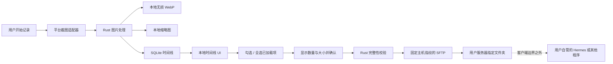

# Electronic Journey 产品与技术设计说明书

版本：0.5.0

更新时间：2026-07-30

状态：平台感知的稳定内容去重和系统活动监听已实现，待 macOS 与 Windows 真机验收

## 1. 产品定义

Electronic Journey 是一款面向个人用户的数字旅程记录工具。应用仅在用户明确授权并主动运行时截取桌面画面，将无损 WebP 原图、缩略图和时间信息保存在本机，支持本地时间线预览、选择和删除。

用户可以为自己的服务器配置一个 SFTP 目标文件夹。在时间线中勾选一张或多张图片、查看数量和总大小并再次确认后，Rust 客户端才会把这些原图上传到该文件夹。客户端不调用、不配置也不感知 Hermes、提示词、模型或其他远端消费者；远端如何读取图片属于用户服务器边界之外的独立配置。

### 1.1 核心目标

- 截图行为可见、可暂停、可停止，并在权限不足时安全失败。
- 截图时间来自 SQLite 中的 `captured_at_utc`，不依赖文件修改时间。
- 时间线使用缩略图快速加载，预览按需读取并校验本地原图。
- 图片默认留在本机；自动同步默认关闭，只有用户显式开启后才会按计划上传。
- 第一阶段支持逐张勾选、全选当前已加载结果、确认后批量上传。
- 上传目标是用户控制的单个 SFTP 文件夹。
- 私钥口令只进入系统钥匙串；普通配置和数据库不保存口令。
- SSH 主机指纹必须固定并在每次连接时校验。
- 上传失败不影响本地截图、预览、导出或删除已结束任务中的图片。

### 1.2 非目标

- 不建设产品方图片云、对象存储、同步服务或中转服务器。
- 不从客户端调用 LLM 提供商。
- 不在客户端配置或展示 Hermes、提示词、模型和回答。
- 不监控远端文件夹，也不声称远端图片已被后续程序消费。
- 不在未告知或未启用的情况下自动上传。
- 第一期不提供多服务器、多配置、双向同步或远端删除。
- 不把 SSH 密码或私钥正文保存到 SQLite、前端状态或日志。

## 2. 技术栈

| 层 | 技术 | 职责 |
| --- | --- | --- |
| 桌面壳 | Tauri 2 | 生命周期、能力隔离、原生命令 |
| 前端 | React 19、TypeScript、Vite 6 | 时间线、选择、确认、配置和结果反馈 |
| 核心 | Rust | 截图、文件、SQLite、凭据和 SFTP |
| 数据库 | SQLite + `sqlx` | 截图时间线、远程配置、上传批次和项目状态 |
| 图片 | 无损 WebP | 本地原图与有界缩略图 |
| SSH/SFTP | `russh`、`russh-sftp` | 固定主机指纹、私钥认证、远端写入 |
| 凭据 | macOS Keychain / Windows Credential Manager | 私钥口令 |

前端不得获得任意文件系统、shell、截图或网络权限。所有敏感操作均通过窄类型 Tauri 命令进入 Rust。

## 3. 系统边界与数据流

### 3.1 本地可信边界

Rust 核心可以访问应用专用图片目录、SQLite、用户通过原生文件选择器明确选择的私钥文件，以及当前配置对应的系统钥匙串条目。WebView 只能取得时间线元数据、经过校验的图片字节和脱敏后的远程配置；不能取得私钥正文或私钥口令。

### 3.2 个人服务器边界

个人服务器由用户控制，不是 Electronic Journey 的第一方服务。客户端只承诺在 SFTP 层完成以下验证：

1. 连接到用户输入的主机和端口。
2. 服务器公钥 SHA-256 指纹等于已保存值。
3. 指定私钥完成 SSH 认证。
4. 目标根目录存在且是目录。
5. 临时文件完成写入确认并显式关闭后，远端长度与本地字节长度一致。
6. 临时文件原子改名后，最终文件长度仍一致。

客户端不承诺远端磁盘冗余、备份、后续读取、模型处理或远端删除。

## 4. 用户体验

### 4.1 首次使用和记录

- 首次启动说明截图目的、本地保存和停止方式。
- 权限必须由系统流程明确授予。
- 默认间隔 5 分钟；用户保存的截图间隔、捕获范围和空闲暂停设置写入本地 SQLite，并在应用启动时恢复。捕获范围支持所有显示器和当前使用的显示器；后者按当前前台窗口所在显示器判断，无法判断时回退到主显示器。停止、暂停、锁屏、休眠和权限变化应进入明确状态。
- 隐私中心提供开机自启动开关。macOS 使用当前用户的 LaunchAgent，Windows 使用当前用户的启动注册表项；开机启动只进入托盘，不自动开始截图，也不需要管理员权限。该开关以操作系统注册状态为准，不写入 SQLite。
- 用户主动开启记录后，锁屏、系统休眠或达到空闲阈值会进入 `suspended`，立即取消已安排但尚未执行的截图；空闲阈值为 0 时禁用空闲暂停。
- 唤醒、解锁或恢复输入只清除对应阻塞条件。全部阻塞条件解除且用户没有主动暂停或停止时，等待 10 秒再恢复截图，不补拍暂停期间错过的周期。
- 系统活动监听安装失败或运行时失效时停止记录并进入可见错误状态；不能在无法确认锁屏、休眠和空闲状态时继续截图。
- 托盘始终显示当前真实状态、屏幕录制权限状态、今日截图数量和今日已上传数量，并提供开始、暂停、停止和打开主窗口操作；系统暂挂时必须显示锁屏、休眠或空闲原因。
- 托盘开始操作复用与主窗口相同的 Rust 状态机。缺少权限时不得绕过首次授权说明直接触发系统流程，而是打开主窗口并提示用户在那里完成知情授权。
- 关闭主窗口只隐藏窗口并保留可见托盘；真正退出必须使用托盘“退出 Electronic Journey”或系统退出命令。
- SFTP 配置是可选项，不影响本地记录能力。
- 隐私中心通过系统原生选择器添加排除应用：macOS 默认打开 `/Applications` 并接受有效 `.app`，Windows 默认打开 Program Files 并接受有效 `.exe`；Rust 提取与前台检测一致的稳定身份，规则可以停用或移除。
- 启用规则命中前台应用时跳过截图周期，不保存、不补拍、不上传；身份或规则读取失败时同样安全跳过本周期并显示固定的非敏感提示。
- 当前只实现前台应用整周期排除，不实现可见窗口矩形或像素遮挡。

### 4.2 时间线与预览

- 时间线按 SQLite 的 `captured_at_utc` 排序和分组。
- 卡片优先读取最大宽度 1440 像素的本地缩略图。
- 点击卡片后按需读取原图，核对文件大小、SHA-256 和 WebP 可解码性。
- 原图预览支持适应窗口、源图像素比例和缩放。
- 右键菜单保留查看、选择用于上传和永久删除。
- 时间线支持收藏、仅看收藏、创建本地标签、编辑截图标签和按单个标签筛选；这些元数据不修改图片或上传状态。
- 删除本地图片必须二次确认；正在 `pending` 或 `uploading` 的图片暂不可删除。
- 已上传或上传失败的历史记录不阻止本地删除。

### 4.3 选择与上传

- 每张时间线卡片提供独立复选框。
- “全选已加载”只选择当前已从 SQLite 加载到页面的项目，按钮文案必须明确范围。
- 每个日期标题提供“全选当天”，按当前系统时区查询并选择当天全部截图，包括尚未加载的分页项目。
- 顶部持续显示已选数量。
- 点击“上传所选”后必须显示原图数量和总大小，并要求再次确认。
- 未配置服务器、选择为空、选择重复或图片已删除时不创建有效上传。
- 第一阶段单批最多 500 张。
- 上传进行时禁用重复提交。
- 上传进度按字节展示当前阶段、平均速率和预计剩余时间；当前进程内保留最近批次的非敏感聚合计时，不记录路径、内容摘要、图片内容或凭据。
- 结果必须区分全部成功和部分失败，不把请求发起等同于完成。
- 时间线显示最近一次上传状态：未上传、等待、上传中、已上传、失败或取消。

### 4.4 远程存储设置

配置字段包括名称、服务器地址、SSH 端口、用户名、私钥路径、可选私钥口令、远程绝对目录和 SHA-256 SSH 主机指纹。

“读取指纹”只用于建立连接并展示服务器报告的指纹。界面必须提醒用户通过服务器控制台、云厂商面板或管理员提供的信息独立核对，读取动作本身不是可信验证。

“保存配置”不连接网络。私钥必须通过系统原生文件选择器选择，可以位于 `~/.ssh`、Downloads 或用户管理的其他目录；Rust 拒绝符号链接、空文件、超过 64 KiB 的文件以及 Unix 上组或其他用户可读的文件。私钥口令不回显，留空时保留已有钥匙串条目。

“测试已保存配置”由用户主动触发，执行连接、固定指纹、私钥认证，并在目标目录创建、核对和删除一个零字节临时文件。测试不会读取或上传截图。

### 4.5 自动同步

- 自动同步是独立设置，默认关闭；保存服务器配置本身不启用。
- 开启前必须明确告知当天未同步原图将定期离开设备，暂停或停止截图不会关闭同步。
- 默认间隔为 30 分钟，可选择 15、30、60、120 或 240 分钟。
- “当天”按执行时的系统时区计算；只选择当天尚无成功、等待或上传中记录的截图。
- 手动和自动上传共享同一个单活动批次约束；已有上传时本轮自动同步跳过。
- 每批最多 500 张，全部成功后可继续创建下一批，直到本次检查范围清空。
- 提供“立即同步当天图片”，该按钮是一次明确的用户发起网络操作。
- 身份、私钥、钥匙串或固定主机指纹错误会暂停自动同步；重新保存配置或成功测试连接后才恢复。
- 界面显示最近状态、成功/失败数量、下次检查时间和暂停原因。

## 5. 本地文件设计

- 原图为无损 WebP，路径 `captures/YYYY/MM/DD/<capture_uuid>.webp`。
- 缩略图为最大宽度 1440 像素的 WebP，路径 `thumbnails/YYYY/MM/DD/<capture_uuid>.webp`。
- 屏幕截图编码前将 alpha 归一化为完全不透明，原图和缩略图都不保留平台像素缓冲区的透明或填充字节。
- 去重同时计算完整像素摘要和版本化稳定内容摘要；稳定内容摘要只排除平台确认且不超过屏幕边缘 10% 的系统栏区域。
- macOS 排除当前显示器菜单栏顶部条带；Windows 根据当前显示器工作区与完整区域的差值排除任务栏或 AppBar 边缘条带。
- 排除区域只影响去重判定，不裁剪、遮挡或修改最终保存的无损 WebP；区域不可用、越界、重叠或异常过大时退回完整像素精确比较。
- 同一设备和显示器最近记录的稳定内容摘要一致时跳过；区域外任何像素变化仍保存，显示器尺寸、排除区域或策略版本变化会建立新基线。
- 写入采用同目录临时文件、同步、原子改名和回读解码。
- SQLite 保存原图字节长度和 SHA-256。
- 缩略图不作为 SFTP 上传源；上传始终重新读取并验证原图。

## 6. SQLite 设计

### 6.1 `captures`

保存 UUID、设备和显示器标识、`captured_at_utc`、采集时区、本地相对路径、缩略图相对路径、文件大小、文件 SHA-256、完整像素摘要、稳定内容摘要、比较策略和缩略图状态。时间线排序只使用数据库时间。升级前的记录不回填稳定内容摘要，升级后的首张截图作为新基线。

### 6.2 `remote_profiles`

第一期只使用固定标识 `primary`，保存名称、主机、端口、用户名、私钥路径、固定主机指纹、远程根目录、`has_passphrase`、自动同步开关与间隔、下次检查时间、最近状态和暂停原因。`has_passphrase` 只表示系统钥匙串中应存在口令。自动同步开关迁移默认值必须为关闭。

### 6.3 `upload_batches`

状态包括 `pending`、`uploading`、`completed`、`partial_failed` 和 `cancelled`，并保存来源（手动或自动）、总项目数、总字节数、完成数和失败数。崩溃恢复时，遗留的 `pending`/`uploading` 项目转为 `failed` 并记录 `interrupted` 错误码，批次转为 `partial_failed`，不得自动继续向网络发送；时间线提示用户后，只能通过显式重试创建新批次。自动调度只能在下一次计划检查重新筛选。

### 6.4 `upload_items`

每项保存批次、截图 UUID、稳定远端相对路径、创建批次时的大小和 SHA-256 快照、状态、尝试次数、有限错误码和时间戳。上传项目不使用指向 `captures` 的外键，因此上传结束后可删除本地图片并保留不含内容的历史；活动项目仍通过事务检查阻止删除。

### 6.5 迁移

`0002_personal_sftp_uploads.sql` 删除尚未投入使用的 `ai_jobs` 和 `ai_job_captures`，建立个人服务器配置与上传队列。此迁移不删除 `captures` 或本地图片。

`0007_capture_organization_and_privacy.sql` 为收藏查询增加索引，建立规范化的 `tags`、`capture_tags` 和本地 `privacy_app_rules`。标签关系随截图或标签删除级联清理；隐私规则只保存平台、稳定应用标识、显示名称和启用状态，不保存窗口标题、命令行或完整 Windows 可执行路径。

## 7. SFTP 协议设计

### 7.1 连接与认证

- 仅支持 SSH 公钥认证，第一期不支持服务器密码。
- 主机和端口只作为 socket 地址使用，不进入 shell。
- `check_server_key` 必须比较 SHA-256 指纹；不匹配立即停止。
- 私钥正文只在 Rust SSH 库中短期解析。
- 私钥口令从系统钥匙串短期读取，并在使用后清零其字符串缓冲。
- 连接设置有限超时；界面不可无限等待。

### 7.2 远端路径

远程根目录必须是规范化的 POSIX 绝对路径，拒绝 NUL、反斜杠、`.` 和 `..`。每张图片使用：

`YYYY/MM/DD/YYYYMMDDTHHMMSSmmm+0800_<capture_uuid>.webp`

相对路径来自 SQLite 中的 UTC 采集时间转换后的北京时间（固定 UTC+8）和 UUID，不接受前端传入文件名。日期子目录和文件名时间均使用北京时间；客户端只在根目录下创建日期子目录。

### 7.3 完整性和幂等

1. 从 SQLite 读取截图并通过受控应用数据目录解析。
2. 核对文件类型、大小、SHA-256 和 WebP 解码。
3. 最终路径已存在且长度相同时视为幂等完成，不覆盖。
4. 最终路径已存在但长度不同时记录冲突。
5. 写入同目录的随机 `.part` 文件，等待写入确认、显式关闭句柄并核对长度。
6. 原子改名为最终文件，再次核对长度后才标记 `uploaded`。
7. 失败时尽力删除本次临时文件，不删除既有最终文件。

同一已认证连接内缓存已经确认的日期目录；缓存不跨连接或应用重启，临时文件与最终文件仍逐项执行长度核对和原子改名。

SFTP v3 不提供通用远端 SHA-256，因此第一期验证传输前本地 SHA-256、SSH 传输完整性和远端长度。后续如增加内容摘要验证，不得静默执行任意 shell。

## 8. 安全与隐私

- 默认无外发；网络操作必须来自用户读取指纹、测试连接、确认上传、点击立即同步，或用户显式启用后的到期自动同步。
- 浏览器开发 fallback 不模拟网络、上传、测试或删除成功。
- 前端只能提交截图 UUID，不能提交任意本地路径或远端最终文件名。
- 日志不得包含截图、缩略图、私钥、口令、远程完整路径、服务器响应正文或图片哈希。
- 数据库不保存密钥和口令。
- 主机指纹变化必须显式失败，不能自动更新。
- 测试连接创建的文件名不含截图信息，并在验证后删除。
- 上传失败与截图采集状态隔离。

## 9. Tauri 命令边界

- `get_remote_profile()`：返回脱敏配置；
- `probe_remote_host_key(host, port)`：读取服务器公钥指纹；
- `save_remote_profile(input)`：本地验证并保存配置，口令进入钥匙串；
- `test_remote_profile()`：测试已保存配置与目标目录写权限；
- `upload_selected_captures(capture_ids)`：创建后台批次并立即返回批次状态；
- `get_upload_batch_status(batch_id)`：读取指定批次及逐项进度；
- `get_active_upload_batch()`：恢复当前活动批次的界面跟踪。
- `get_latest_unhandled_interrupted_upload_batch()`：读取最近仍等待用户处理的启动恢复批次，不启动网络任务；
- `retry_failed_upload_items(batch_id)`：只为指定批次的失败项目创建新的手动上传批次；
- `cancel_upload_batch(batch_id)`：取消尚未开始的项目；当前正在传输的项目完成后记录真实结果。
- `sync_today_now()`：仅在自动同步已启用且未暂停时，明确触发当天未同步图片的后台同步。
- `set_launch_at_login(enabled)`：设置当前用户的开机自启动，并返回包含 `launchAtLogin` 的运行快照。
- `set_timeline_capture_favorite(capture_id, favorite)`：幂等更新本地收藏状态；
- `list_timeline_tags()`、`create_timeline_tag(name)`、`delete_timeline_tag(tag_id)` 与 `set_timeline_capture_tags(capture_id, tag_ids)`：管理本地标签和截图关系；
- `list_privacy_app_rules()`、`pick_privacy_application_rule()`、`set_privacy_app_rule_enabled(rule_id, enabled)` 与 `delete_privacy_app_rule(rule_id)`：通过系统选择器管理由 Rust 验证的应用排除规则。

命令不接受私钥正文、本地图片路径、任意远端路径、shell 命令、Hermes 配置、提示词或模型参数。

## 10. 失败、恢复与状态

- 单张失败不终止本地记录，可继续处理同批其他项目。
- 启动命令不等待网络上传完成；Rust 后台任务推进批次，界面轮询 SQLite 展示进度。
- 页面切换和时间线刷新不取消后台任务；同一时刻只允许一个活动批次。
- 应用启动时将遗留的 `pending`/`uploading` 项目标为 `failed(interrupted)`，并把批次转为 `partial_failed`；恢复过程不重放网络请求。最近仍未创建重试批次的中断批次会在时间线提示用户处理。
- 连接、指纹或认证失败时，本批所有项目记为失败并保存明确错误。
- 应用重启后不得自动重放未完成网络请求。
- 自动同步到期检查使用跳过式时钟，不补发休眠期间错过的多个周期。
- 远端最终文件已存在且长度相同可安全重试。
- 部分失败必须保留逐项状态。
- 删除本地图片仅在活动上传结束后允许；不会远程删除副本。

## 11. 测试策略

Rust 和 SQLite 测试覆盖输入验证、路径逃逸、迁移、批次上限、确定性文件名、上传状态与删除互锁。前端检查覆盖浏览器 fallback、全选范围、上传确认、自动同步默认关闭与开启告知、间隔配置、重复提交、结果文案和口令不回显。

收藏、标签与应用排除测试覆盖旧记录迁移、收藏和标签筛选、标签规范化与级联删除、规则启停、所选应用元数据验证、稳定身份匹配、身份读取失败时跳过，以及元数据不改变图片文件和上传输入。macOS 与 Windows 仍需真机验证系统选择器初始目录、前台身份匹配和多显示器行为。

自动同步测试覆盖迁移默认关闭、日期边界、已成功项目排除、失败项下周期重试、500 张分批、单活动批次竞争、修改间隔后的重排、重启不重放、安全错误暂停以及关闭开关时不创建网络任务。

隔离 SFTP 集成验证覆盖正确和错误指纹、正确和错误密钥、不可写目录、中断写入、同名冲突、日期目录、最终文件名及日志扫描。

## 12. 实施阶段

### 阶段一：个人 SFTP 手动上传

- 调整设计、架构、威胁模型和 API 文档；
- SQLite 远程配置、批次和项目迁移；
- 系统钥匙串保存私钥口令；
- 固定主机指纹的 SFTP 连接；
- 配置读取、保存和写权限测试；
- 时间线逐张选择、全选已加载项、确认和批量上传；
- 状态展示与删除互锁；
- 单元、迁移、前端和 Rust 检查。

### 后续候选

- 失败项显式重试和取消；
- 选择日期范围和跨分页全选；
- 多个个人服务器配置；
- 可选带宽和并发限制；
- 经隐私审查的远端内容摘要验证。

这些候选不得让客户端感知远端 Hermes/LLM，也不得绕过自动同步的显式开关和告知。

## 13. 第一阶段验收标准

- 未配置服务器时，本地截图、预览和删除仍可使用。
- 新安装和迁移后的自动同步均为关闭；关闭时不会按计划发起 SFTP 连接或上传。
- 用户显式启用后，到期任务只同步当天未同步图片，并可随时关闭。
- 私钥口令不出现在 SQLite、前端回读值或日志中。
- 测试连接验证远端目录可写并清理临时文件。
- 用户能勾选单张或全选当前已加载截图。
- 上传前明确展示数量和大小并要求确认。
- 只有受控目录中通过完整性校验的原图会被上传。
- 指纹不匹配、认证失败和远端冲突不会覆盖文件或显示成功。
- 上传完成后时间线显示准确状态；部分失败不会被描述为全部成功。
- 客户端代码和配置中没有 Hermes、提示词、模型或 LLM 请求参数。
