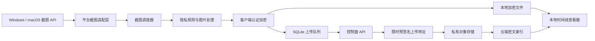
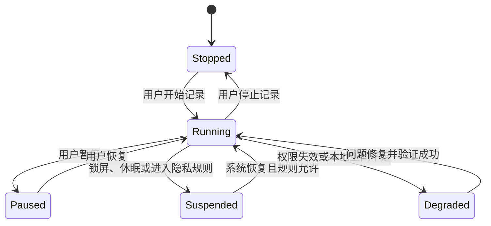

# Electronic Journey 跨平台桌面应用设计说明书

> 文档版本：0.1.0  
> 文档状态：初稿  
> 更新日期：2026-07-28  
> 目标平台：Windows、macOS

## 1. 文档概述

### 1.1 项目背景

Electronic Journey 是一款面向个人用户的数字旅程记录工具。应用在用户明确授权并处于运行状态时，按照设定的时间间隔截取桌面画面，将截图安全地保存在本地，并以端到端加密形式上传至云端。

产品的目标不是监控用户或其他人员，而是帮助用户留存自己的数字生活轨迹，例如工作过程、学习记录、创作过程和阶段性回顾。

### 1.2 设计目标

- 同一套产品支持 Windows 和 macOS。
- 应用可以长期低资源占用地驻留在系统托盘或菜单栏。
- 截图在离开本机前完成加密，云端服务器不能读取原图。
- 网络中断、系统休眠或应用崩溃后能够安全恢复，不丢失已完成的截图。
- 用户可以随时暂停、查看、导出和删除自己的记录。
- 所有敏感能力保持可见、可控、可撤销。
- 架构能够支持后续加入本地 OCR、时间线搜索和多设备同步。

### 1.3 非目标

第一阶段不包含以下能力：

- 隐蔽运行、隐藏托盘图标或绕过系统截图授权。
- 键盘记录、剪贴板记录、浏览器历史收集或麦克风录音。
- 企业员工监控、远程监控或管理员强制截图。
- 服务端识别、分析或生成截图内容摘要。
- 实时屏幕直播或远程控制。
- 手机端截图。

## 2. 技术选型

### 2.1 推荐技术栈

| 模块 | 技术选型 | 用途 |
|---|---|---|
| 桌面应用框架 | Tauri 2 | 窗口、托盘、应用生命周期、安装包和升级 |
| 前端界面 | React + TypeScript + Vite | 设置、时间线、状态展示和用户交互 |
| 核心逻辑 | Rust | 调度、截图适配、图片处理、加密、本地存储和上传 |
| Windows 截图 | Windows.Graphics.Capture | 获取显示器画面 |
| macOS 截图 | ScreenCaptureKit | 获取显示器画面并遵循系统权限机制 |
| 本地数据库 | SQLite + `sqlx` | 截图索引、上传队列和非敏感配置 |
| HTTP 客户端 | `reqwest` | API 调用和密文上传 |
| 图片编码 | Rust `image` 及 WebP 编码库 | 缩放、压缩和格式转换 |
| 内容加密 | XChaCha20-Poly1305 | 图片和敏感元数据的认证加密 |
| 密钥存储 | macOS Keychain / Windows DPAPI | 保护本地主密钥和登录凭据 |
| 后端 API | Rust Axum 或 Go | 身份认证、设备管理和上传编排 |
| 元数据存储 | PostgreSQL | 用户、设备和云端对象状态 |
| 对象存储 | S3 兼容存储 | 保存加密截图对象 |
| 自动升级 | Tauri Updater | 验证签名后安装更新 |

### 2.2 选择 Tauri 2 的原因

- 后台常驻资源占用相对较低。
- Rust 适合处理文件、并发、图片和密码学逻辑。
- 敏感能力可以保留在 Rust 端，前端只能调用经过授权的有限命令。
- 可以通过平台适配层分别接入 Windows 和 macOS 原生截图 API。
- 支持 Windows 和 macOS 安装包、代码签名及签名升级。
- React 前端便于快速实现设置页和时间线等产品界面。

### 2.3 备选方案

| 方案 | 适用场景 | 主要取舍 |
|---|---|---|
| Electron | 团队只熟悉 JavaScript，需要快速验证 | 开发快，但长期驻留的内存和安装包通常更大 |
| Avalonia | 团队主要使用 C#/.NET | UI 跨平台能力较好，仍需平台截图适配 |
| Flutter Desktop | 需要高度自定义的统一界面 | 桌面后台、托盘和截图能力需要较多原生插件 |
| 双原生客户端 | 对平台体验和系统集成要求最高 | 需要维护两套客户端，成本最高 |

## 3. 总体架构



### 3.1 客户端分层

#### 表现层

负责设置页、时间线、状态展示和用户操作，不直接访问任意文件、网络或操作系统截图接口。

#### Tauri 命令层

向前端暴露经过限制的命令，例如：

- 查询当前记录状态。
- 开始或暂停记录。
- 更新截图周期。
- 选择本地保存目录。
- 获取时间线分页数据。
- 解密并展示指定截图。
- 导出或删除指定截图。

Tauri capability 应遵循最小权限原则，只为指定窗口启用必要命令。

#### 核心服务层

由 Rust 实现以下服务：

- `CaptureService`：调用平台截图适配器。
- `SchedulerService`：管理时间计划、休眠恢复和跳过策略。
- `PrivacyService`：判断是否处于允许截图的状态。
- `ImageService`：缩放、压缩和重复画面检测。
- `CryptoService`：生成文件密钥、加密及解密。
- `VaultService`：原子写入、读取和删除本地文件。
- `UploadService`：管理预签名地址、上传、重试和确认。
- `TimelineService`：提供本地时间线索引。

#### 平台适配层

统一定义截图接口，由 Windows 和 macOS 分别实现：

```rust
pub trait ScreenCapture {
    async fn permission_state(&self) -> Result<PermissionState>;
    async fn request_permission(&self) -> Result<PermissionState>;
    async fn list_displays(&self) -> Result<Vec<DisplayInfo>>;
    async fn capture(&self, display_id: &DisplayId) -> Result<CapturedImage>;
}
```

macOS 使用 ScreenCaptureKit；Windows 使用 Windows.Graphics.Capture。上层不依赖具体平台类型。

### 3.2 服务端分层

- 身份服务：登录、令牌刷新和会话撤销。
- 设备服务：注册、命名和撤销设备。
- 上传服务：签发单对象、短时有效的上传地址。
- 对象确认服务：回查对象是否存在并验证密文大小和摘要。
- 时间线元数据服务：返回用户自己的加密对象列表。
- 删除服务：删除数据库记录和对象存储中的密文。

服务端不持有用户的明文主密钥，不生成明文缩略图，也不执行图片识别。

## 4. 功能设计

### 4.1 首次启动

首次启动引导包含：

1. 阅读隐私说明并主动开启记录功能。
2. 选择截图间隔和工作时间。
3. 选择要记录的显示器。
4. 请求系统屏幕录制权限。
5. 选择本地加密文件夹或使用默认目录。
6. 创建云端账号或选择仅本地模式。
7. 生成并确认保存恢复密钥。
8. 执行测试截图、加密、回读和上传验证。

任何一个必要步骤失败时，都应明确显示失败原因，不应把“已请求权限”或“上传已开始”视为成功。

### 4.2 定时截图

用户可以配置：

- 截图间隔，建议允许 1、2、5、10、15、30 和 60 分钟。
- 生效的星期。
- 每日生效时间段。
- 要记录的显示器。
- 是否在用户空闲时继续截图。
- 是否跳过重复画面。
- 图片质量和最大分辨率。

默认配置：

- 每 5 分钟截图一次。
- 用户连续空闲 10 分钟后暂停。
- 锁屏、休眠和登录界面不截图。
- 唤醒后恢复正常计划，不补拍休眠期间的任务。
- WebP 质量为 85，最大宽度为 2560 像素。
- 只记录用户首次选择的显示器。

### 4.3 运行状态

状态机定义如下：



托盘或菜单栏必须持续显示当前状态：

- 绿色：正在记录。
- 黄色：临时暂停或等待权限。
- 红色：本地保存失败、密钥错误或其他需要处理的问题。
- 灰色：记录功能已停止。

上传失败不应阻止本地截图，但必须显示待上传数量和最近错误。

### 4.4 暂停与隐私规则

支持以下控制：

- 暂停 15 分钟。
- 暂停 1 小时。
- 暂停到第二天。
- 无限期暂停。
- 跳过用户配置的应用。
- 可选的截图前通知。
- 删除最近一张截图。

默认不收集窗口标题、应用内文本、键盘输入、剪贴板或浏览历史。

第一阶段的 Windows 应用排除策略可以采用“检测前台应用并跳过本次截图”。macOS 可在平台能力允许时使用 ScreenCaptureKit 内容过滤。后续如加入 OCR 脱敏，必须在本地、加密前执行。

### 4.5 时间线

时间线提供：

- 按日期分组浏览。
- 按设备和显示器筛选。
- 查看上传状态。
- 放大查看原图。
- 导出单张或日期范围。
- 删除单张或日期范围。
- 标记收藏。

服务端无法生成明文缩略图，因此缩略图应在本机解密后生成，只存放于受控本地缓存。退出登录或用户清理缓存时删除。

### 4.6 本地和云端模式

支持两种运行方式：

- 仅本地：截图只写入本地加密保险箱。
- 本地加云端：本地保存后进入上传队列，云端保存密文副本。

本地保存提供两种格式：

- 安全模式，默认：仅保存加密的 `.ejourney` 文件。
- 兼容模式：额外保存普通 WebP 文件，并明确提示本地明文风险。

## 5. 截图处理流程

一次截图任务的执行顺序：

1. 调度器产生到期事件。
2. 检查记录状态、系统锁定状态、空闲状态和隐私排除规则。
3. 为本次任务生成唯一 `capture_id`。
4. 调用平台适配层获取目标显示器画面。
5. 在内存中完成尺寸限制、WebP 编码和可选的重复检测。
6. 为图片生成随机文件数据密钥。
7. 对图片及敏感元数据进行认证加密。
8. 将密文写入同目录临时文件。
9. 刷新文件内容并原子重命名为正式文件。
10. 在 SQLite 事务中创建截图记录和上传任务。
11. 清理内存中的明文图片及临时密钥。
12. 异步唤醒上传服务。

如果步骤 8 至 10 中任一步骤失败，不得将任务标记为成功。启动恢复时应检查并清理超时临时文件。

## 6. 加密与密钥设计

### 6.1 威胁模型

需要防护：

- 网络传输被窃听或篡改。
- 云端对象存储泄露。
- 服务端数据库泄露。
- 运维人员意外访问对象。
- 密文文件被替换或损坏。

不能完全防护：

- 用户已解锁且本机已被恶意软件完全控制。
- 攻击者能够读取应用进程内存。
- 用户主动导出的明文文件被其他程序读取。
- 用户同时丢失所有设备和恢复密钥。

### 6.2 加密模型

采用信封加密：

1. 每个截图生成独立的随机 256 位数据密钥。
2. 使用 XChaCha20-Poly1305 加密图片内容。
3. 使用用户主密钥包装数据密钥。
4. 将包装后的数据密钥与图片密文一同保存。
5. 主密钥由操作系统安全存储保护。

认证附加数据可以包含：

- 文件格式版本。
- 截图记录 ID。
- 密钥版本。

解密前必须验证认证标签；验证失败时不得输出任何部分明文。

### 6.3 主密钥存储

- macOS：保存到用户 Keychain。
- Windows：使用当前用户作用域的 DPAPI 保护。
- SQLite、日志、普通配置文件和云端数据库不得保存明文主密钥。
- 登录令牌和刷新令牌采用相同的系统安全存储原则。

### 6.4 恢复密钥

首次开启云同步时生成高强度恢复密钥，用于保护主密钥的恢复副本。

要求：

- 恢复密钥只向用户显示，不上传明文。
- 应要求用户确认已经保存。
- 可以生成适合打印的恢复文档。
- 忘记登录密码不等于恢复加密资料。
- 如果用户丢失所有已授权设备及恢复密钥，服务端无法恢复图片。

### 6.5 加密文件格式

建议的容器结构：

```text
magic                 4 bytes   "EJRN"
format_version        2 bytes
algorithm_id          2 bytes
record_id            16 bytes
key_version           4 bytes
wrapped_key_length    4 bytes
wrapped_data_key      variable
nonce                24 bytes
ciphertext            variable
authentication_tag   16 bytes
```

文件扩展名使用 `.ejourney`。解析器必须限制所有长度字段，拒绝超大或截断输入。

## 7. 本地存储设计

### 7.1 默认目录

通过系统特殊目录 API 获取 Pictures 目录，在其下创建：

```text
ElectronicJourney/
├── vault/
│   └── <device-id>/
│       └── <year>/<month>/<day>/<random-id>.ejourney
├── exports/
└── recovery/
```

用户可以选择其他目录。应用不能假定用户目录路径，也不能依赖指向项目外部的软链接。

### 7.2 SQLite 数据表

#### `captures`

| 字段 | 类型 | 说明 |
|---|---|---|
| `id` | TEXT PK | 截图 UUID |
| `device_id` | TEXT | 来源设备 |
| `display_id` | TEXT | 来源显示器的本地标识 |
| `captured_at_utc` | TEXT | UTC 时间 |
| `timezone` | TEXT | 截图时的 IANA 时区 |
| `local_path` | TEXT | 本地密文相对路径 |
| `cipher_size` | INTEGER | 密文大小 |
| `cipher_sha256` | TEXT | 密文摘要 |
| `key_version` | INTEGER | 主密钥版本 |
| `sync_state` | TEXT | 同步状态 |
| `created_at_utc` | TEXT | 记录创建时间 |

#### `upload_jobs`

| 字段 | 类型 | 说明 |
|---|---|---|
| `id` | TEXT PK | 上传任务 UUID |
| `capture_id` | TEXT UNIQUE | 关联截图 |
| `state` | TEXT | `pending/uploading/retry/completed/failed` |
| `attempt_count` | INTEGER | 尝试次数 |
| `next_attempt_at_utc` | TEXT | 下次重试时间 |
| `last_error_code` | TEXT | 脱敏错误码 |
| `updated_at_utc` | TEXT | 更新时间 |

#### `settings`

只保存非敏感设置，例如间隔、时间段、显示器选择和图片质量。密钥和令牌不得保存在该表。

### 7.3 时间语义

- 数据库存储 UTC。
- 同时保存截图发生时的 IANA 时区。
- 界面默认按当前系统时区显示。
- 日期分组应基于用户选择的展示时区，而不是服务器本地时区。

## 8. 云端接口设计

### 8.1 设备注册

```http
POST /v1/devices
Authorization: Bearer <access-token>
Content-Type: application/json

{
  "name": "My MacBook",
  "platform": "macos",
  "app_version": "0.1.0",
  "device_public_key": "<encoded-public-key>"
}
```

服务端返回不可枚举的设备 ID。设备撤销后不再允许申请新的上传或下载地址。

### 8.2 初始化上传

```http
POST /v1/uploads/init
Authorization: Bearer <access-token>
Content-Type: application/json

{
  "capture_id": "<uuid>",
  "cipher_size": 425136,
  "cipher_sha256": "<hex>",
  "captured_at_utc": "2026-07-28T08:30:00Z",
  "encrypted_metadata": "<base64>"
}
```

返回：

```json
{
  "upload_id": "<uuid>",
  "object_key": "<random-object-key>",
  "method": "PUT",
  "upload_url": "<short-lived-presigned-url>",
  "expires_at_utc": "2026-07-28T08:40:00Z",
  "required_headers": {
    "content-type": "application/octet-stream"
  }
}
```

上传地址必须：

- 仅允许写入一个随机对象键。
- 有效期尽可能短。
- 限制 HTTP 方法。
- 限制允许的内容长度或由完成接口严格回查。
- 不出现在客户端日志、分析事件或错误报告中。

### 8.3 完成上传

```http
POST /v1/uploads/{upload_id}/complete
Authorization: Bearer <access-token>
Content-Type: application/json

{
  "cipher_sha256": "<hex>"
}
```

服务端回查对象存在性、大小和摘要后才能返回完成。客户端收到成功响应后，才能将任务标记为 `completed`。

### 8.4 时间线与删除

```text
GET    /v1/captures?cursor=<cursor>&limit=50
DELETE /v1/captures/{capture_id}
POST   /v1/devices/{device_id}/revoke
```

删除应支持幂等调用。服务端只有在对象存储和数据库状态均达到预期后才返回明确结果；异步删除则必须暴露可查询的删除状态。

## 9. 上传队列与重试

### 9.1 上传策略

- 本地保存与云端上传解耦。
- 上传任务使用截图 ID 作为幂等依据。
- 同一任务并发时只允许一个执行者持有租约。
- 默认并发上传数量为 2。
- 失败后使用指数退避和随机抖动。
- 预签名地址失效时重新申请，不复用旧地址。
- 网络恢复后按创建时间继续处理，不阻塞新截图。

### 9.2 错误分类

| 类型 | 示例 | 处理 |
|---|---|---|
| 可重试 | 断网、超时、服务端 5xx | 指数退避 |
| 需重新认证 | 401、刷新令牌失效 | 暂停上传并提示登录 |
| 需重新申请地址 | 预签名地址过期 | 重新执行初始化 |
| 不可重试 | 密文文件丢失、摘要不匹配 | 标记失败并提示用户 |
| 本地高风险 | 磁盘已满、密钥不可用 | 停止截图并进入红色状态 |

### 9.3 本地队列上限

默认本地密文上限为 10 GB。达到阈值时：

1. 停止创建新截图。
2. 保留既有文件，不自动删除未上传数据。
3. 向用户显示释放空间、修改目录或调整保留策略的入口。

除非用户预先明确开启自动清理，否则不应为了继续截图而删除未上传记录。

## 10. 隐私与安全要求

### 10.1 用户知情

- 截图功能必须由用户主动开启。
- 托盘或菜单栏图标不能隐藏。
- 权限被撤销后必须停止截图。
- 开机启动必须由用户显式启用。
- 应用退出时明确说明是否同时停止后台服务。
- 不提供静默部署或绕过系统提示的功能。

### 10.2 日志规范

允许记录：

- 截图任务 ID。
- 时间、耗时和密文大小。
- 状态码和脱敏错误码。
- 队列长度。

禁止记录：

- 图片内容或缩略图。
- 明文密钥和登录令牌。
- Authorization Header。
- 预签名 URL。
- Cookie。
- 窗口标题和用户正在编辑的文字。
- 用户选择目录中的其他文件名。

### 10.3 网络要求

- 所有控制面 API 只允许 HTTPS。
- 对象上传只允许 HTTPS。
- 客户端验证服务端证书，不提供关闭验证的生产配置。
- API 令牌采用短期访问令牌和可撤销刷新令牌。
- 上传地址不能具有列目录、读取其他对象或删除对象的权限。

### 10.4 软件供应链

- macOS 应用进行 Developer ID 签名和公证。
- Windows 安装包进行 Authenticode 签名。
- 自动更新包必须验证 Tauri 更新签名。
- 更新私钥与应用代码仓库分离保存。
- 依赖版本锁定，并定期执行漏洞扫描。

## 11. 性能与容量

### 11.1 资源目标

建议第一阶段目标：

- 无截图任务时 CPU 接近空闲。
- 常驻内存目标不超过 150 MB。
- 单次截图处理完成后立即释放原始像素缓冲区。
- 图片编码和加密不阻塞 UI 线程。
- 默认最多同时处理一个截图任务，避免任务堆积。

### 11.2 容量估算

按照每天活跃 10 小时、每 5 分钟一张计算：

```text
120 张/天 × 400 KB ≈ 48 MB/天
48 MB × 30 天 ≈ 1.44 GB/月
1.44 GB × 12 月 ≈ 17.28 GB/年
```

双显示器会接近翻倍。实际大小取决于屏幕分辨率、变化程度和图片质量。

不建议在云端对不同用户执行明文或可关联的跨用户去重，因为这会泄露内容相等关系。重复检测只在本地执行。

## 12. 异常恢复

### 12.1 启动恢复

应用启动时执行：

1. 检查数据库迁移状态。
2. 检查本地主密钥是否可用。
3. 扫描超时临时文件。
4. 检查 `uploading` 状态的过期任务并改为 `retry`。
5. 校验数据库引用的本地文件是否存在。
6. 检查系统截图权限。
7. 恢复符合时间计划的记录状态。

### 12.2 休眠和唤醒

- 休眠前停止正在进行的平台截图会话。
- 唤醒后重新枚举显示器。
- 等待系统状态稳定后恢复调度。
- 不为休眠期间积压的时间点补拍截图。
- 外接显示器消失时暂停对应显示器，不自动改为其他屏幕。

### 12.3 文件损坏

- 使用密文 SHA-256 检测传输或存储损坏。
- 使用 AEAD 认证标签检测恶意篡改或错误密钥。
- 损坏文件不得输出部分明文。
- 本地和云端副本不一致时，保留两者并提示用户选择修复来源。

## 13. 界面设计

### 13.1 今日

展示：

- 当前记录状态。
- 下次截图时间。
- 今日已记录数量。
- 本地和云端占用。
- 待上传数量。
- 最近一张截图。
- 快速暂停按钮。

### 13.2 时间线

以日期为主轴展示截图卡片，支持分页和按需解密，避免一次性解密整日截图。

### 13.3 隐私中心

包含：

- 生效时段。
- 显示器选择。
- 应用排除名单。
- 空闲暂停规则。
- 截图前通知。
- 本地明文兼容模式。
- 权限状态及打开系统设置入口。

### 13.4 存储与安全

包含：

- 本地保险箱目录。
- 本地和云端容量。
- 保留策略。
- 设备列表与撤销。
- 恢复密钥状态。
- 导出、删除和清理缓存。

## 14. 项目目录建议

```text
electronic-journey/
├── src/
│   ├── components/
│   ├── pages/
│   ├── stores/
│   ├── api/
│   └── types/
├── src-tauri/
│   ├── capabilities/
│   ├── migrations/
│   ├── src/
│   │   ├── capture/
│   │   │   ├── mod.rs
│   │   │   ├── windows.rs
│   │   │   └── macos.rs
│   │   ├── crypto/
│   │   ├── database/
│   │   ├── image/
│   │   ├── privacy/
│   │   ├── scheduler/
│   │   ├── upload/
│   │   ├── vault/
│   │   └── lib.rs
│   ├── Cargo.toml
│   └── tauri.conf.json
├── server/
│   ├── api/
│   ├── migrations/
│   ├── storage/
│   └── tests/
├── docs/
│   ├── threat-model.md
│   ├── file-format.md
│   └── api.md
└── README.md
```

## 15. 开发阶段

### 15.1 阶段一：本地可信 MVP

- Tauri 项目骨架。
- Windows 和 macOS 截图权限及单次截图。
- 托盘状态与开始、暂停功能。
- 定时调度和休眠恢复。
- 图片压缩。
- 本地密钥生成与安全存储。
- 加密文件写入和回读。
- SQLite 时间线。
- 删除和导出。

### 15.2 阶段二：云端同步

- 用户登录。
- 设备注册与撤销。
- 预签名上传流程。
- 断网续传和幂等处理。
- 云端密文列表。
- 删除同步。
- 多端恢复密钥验证。

### 15.3 阶段三：旅程增强

- 本地 OCR。
- 本地全文搜索。
- 应用级隐私遮挡。
- 每日摘要。
- 收藏和标签。
- 多设备时间线合并。
- 按日期导出个人旅程包。

## 16. 测试计划

### 16.1 功能测试

- 不同截图间隔能够正确生效。
- 多显示器选择和热插拔处理正确。
- 暂停、恢复和时间段规则正确。
- 本地模式和云端模式正确切换。
- 导出及删除行为符合预期。

### 16.2 平台测试

- macOS 首次授权、拒绝授权和撤销授权。
- Windows 捕获能力检测及显示器变化。
- 不同 DPI、缩放比例和分辨率。
- Intel 与 Apple Silicon macOS。
- Windows x64，必要时扩展到 ARM64。

### 16.3 可靠性测试

- 写文件中途强制结束进程。
- 上传中途断网。
- 预签名地址过期。
- 系统睡眠和唤醒。
- 本地磁盘已满。
- 数据库被锁定或迁移失败。
- 重复启动应用。
- 自动更新中断。

### 16.4 安全测试

- 服务端无法解密上传对象。
- 修改密文任意字节后解密必须失败。
- 使用错误主密钥时不得产生部分明文。
- 日志中不存在密钥、令牌和预签名地址。
- 已撤销设备不能申请上传或下载地址。
- 前端不能调用未授权的 Tauri 命令。
- 自动更新不能安装无有效签名的包。

## 17. MVP 验收标准

第一版满足以下条件方可视为完成：

- 用户可以在 Windows 和 macOS 上完成截图授权。
- 用户可以开始、暂停和停止记录。
- 应用按设定间隔截图，锁屏和休眠期间不截图。
- 截图默认只以加密形式写入指定或默认目录。
- 应用重启后可以读取并展示历史截图。
- 任意密文篡改都能被发现。
- 云端启用时，断网后能够自动续传。
- 服务端和对象存储只能获得密文。
- 上传完成经过服务端回查验证。
- 用户能够删除本地和云端记录。
- 托盘始终能显示真实运行状态。
- 日志不包含截图内容、密钥、令牌或临时上传地址。
- 恢复密钥经过一台新环境的实际恢复测试。

## 18. 风险与待确认事项

| 风险或问题 | 影响 | 建议 |
|---|---|---|
| macOS 权限体验和系统版本差异 | 首次使用可能需要跳转系统设置或重启应用 | 首次引导中提供状态检测和明确说明 |
| Windows 捕获提示与后台体验 | 可能影响无干扰记录体验 | 优先遵循系统安全模型并进行原型验证 |
| 长期存储成本 | 多显示器和高分辨率会快速增长 | 提供质量、间隔和保留策略 |
| 恢复密钥丢失 | 历史数据不可恢复 | 强制确认保存并提供多份离线备份建议 |
| 本机被完全入侵 | 运行中的密钥和明文可能暴露 | 明确威胁边界，减少明文驻留时间 |
| 服务端无法生成缩略图 | 跨设备时间线首屏加载较慢 | 本地解密并缓存缩略图 |

实施前还需要确认：

- MVP 是否必须支持多显示器同时截图。
- 是否允许仅云端保留、上传后自动删除本地副本。
- 首个云端部署使用托管 S3、R2 还是自建 MinIO。
- 是否从第一版开始支持多设备恢复。
- 首发最低系统版本。
- 产品是否需要上架 Mac App Store 和 Microsoft Store，还是先采用官网下载。

## 19. 参考资料

- [Tauri 2 Capabilities](https://v2.tauri.app/security/capabilities/)
- [Tauri Updater](https://v2.tauri.app/plugin/updater/)
- [Apple ScreenCaptureKit](https://developer.apple.com/documentation/screencapturekit)
- [Microsoft Windows Screen Capture](https://learn.microsoft.com/en-us/windows/apps/develop/media-authoring-processing/screen-capture)
- [Apple Storing Keys in the Keychain](https://developer.apple.com/documentation/security/storing-keys-in-the-keychain)
- [Microsoft CryptProtectData](https://learn.microsoft.com/en-us/windows/win32/api/dpapi/nf-dpapi-cryptprotectdata)
- [libsodium XChaCha20-Poly1305](https://libsodium.gitbook.io/doc/secret-key_cryptography/aead/chacha20-poly1305)
- [AWS S3 Presigned URLs](https://docs.aws.amazon.com/AmazonS3/latest/userguide/using-presigned-url.html)
- [OWASP Cryptographic Storage Cheat Sheet](https://cheatsheetseries.owasp.org/cheatsheets/Cryptographic_Storage_Cheat_Sheet.html)
